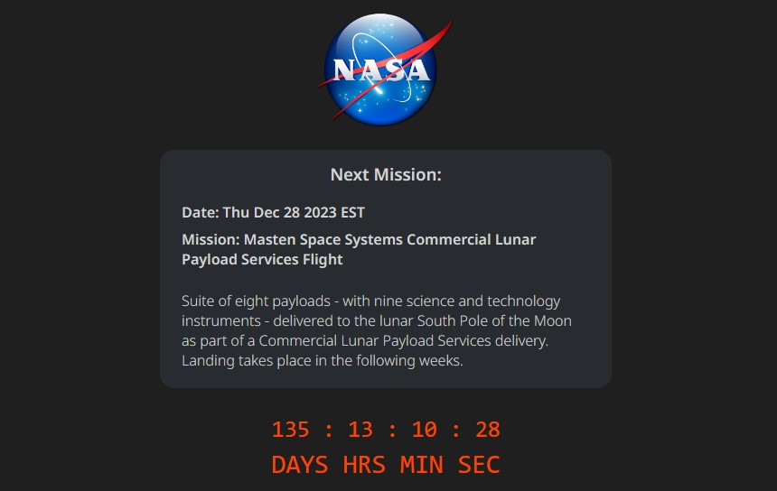

# Countdown to the Next NASA Space Mission

This simple app is based on the idea from this Scrimba training video: 
https://www.youtube.com/watch?v=i9xpSr87QrM
The code is completely reworked, and I have added a data feed with multiple missions.

Info on preloading fonts to prevent UI flicker at page load: https://dev.to/danielbellmas/preload-fonts-2jh7

Glyphicon courtesy of Icon8: https://icons8.com/

NASA Data: 
https://nssdc.gsfc.nasa.gov/planetary/upcoming.html

TODO:
* Mobile-friendly UI.
* Add a link to the list of all missions.
* A menu button with an option to select any other future mission from the list.
* Use Moments or Luxon library to handle dates operations.