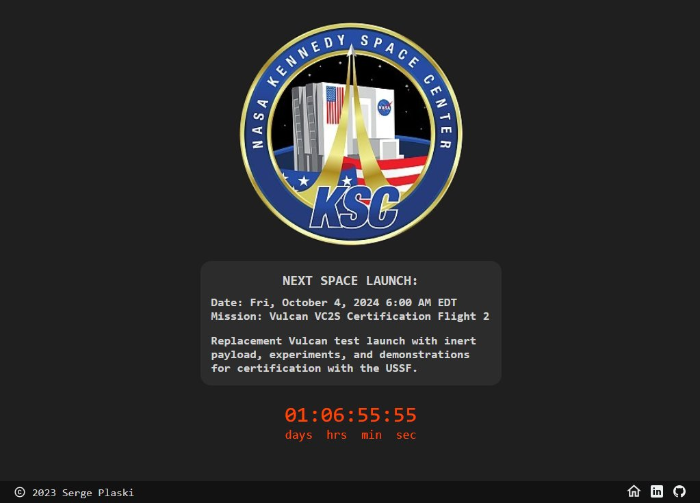

# Countdown to the Next Space Mission

This simple app is based on the idea from this Scrimba training video: 
https://www.youtube.com/watch?v=i9xpSr87QrM
The code is completely reworked, and I have added a data feed with multiple missions.

Info on preloading fonts to prevent UI flicker at page load: https://dev.to/danielbellmas/preload-fonts-2jh7

Glyphicon courtesy of Icon8: https://icons8.com/

NASA Data: 
https://nssdc.gsfc.nasa.gov/planetary/upcoming.html
https://www.nasa.gov/event-type/launch-schedule/

TODO:
- Use Moments or Luxon library to handle dates operations.

UPDATE (2024):
I have used this idea and redesigned the app using React. It now fetches the live data 
and displays the mission info for the next nine upcoming space launch events. 
It also boasts a mobile-first UI design.
Check it out: https://spacelaunches.plaski.com